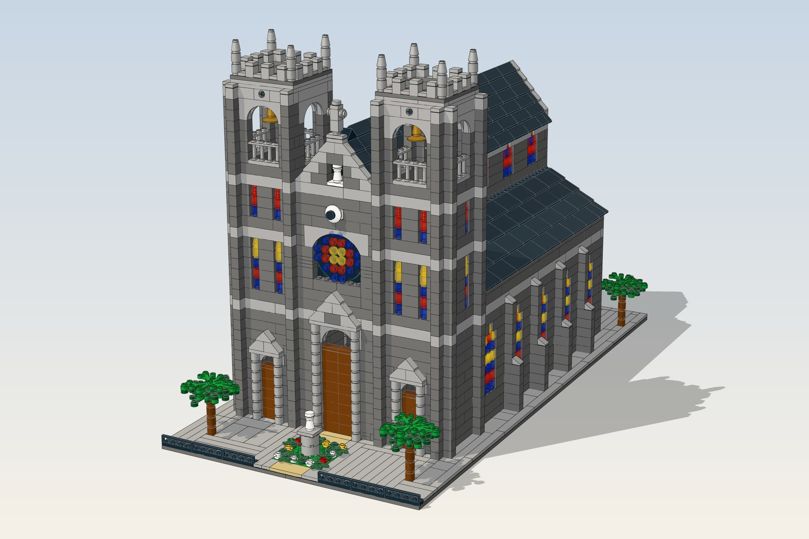

# St. Joseph's Cathedral, Hanoi (LEGO model)

A buildable LEGO design of Nhà thờ Lớn Hà Nội at about 1:100: 2,805 pieces, 114 lots, 32 x 64 studs, towers ~34 cm.

Features: swinging bells (turn the wheel behind each tower), opening portal doors on swivel hinges,
a lift-off nave roof over a furnished interior (pews, arcade, altar), transparent stained glass ready for an LED kit.

## Files
- `output/hanoi_cathedral.ldr` - the model, with building steps (open in Studio, LDCad, LeoCAD or LDView)
- `output/parts_list.csv` - every lot: LDraw id, BrickLink item, LEGO design id, colours, quantity
- `output/bricklink_wanted_list.xml` - upload at BrickLink > Wanted > Upload
- `output/rebrickable_parts.csv` - import into Rebrickable (Part, Color, Quantity)

## Regenerating
The model is generated in `generator/design.py` on a stud grid with collision and connectivity checks
(`python3 check.py` reports overlaps and any piece not attached to the base).
`export.py` writes the LDraw file and parts lists; `thumbs.py`, `steps_render.py`, `hero.py` render with
three.js (`render/`) and `manual.py` + `render/pdf.mjs` build the instruction PDF.
They expect the LDraw parts library at `../ldraw` next to the generator folder.
