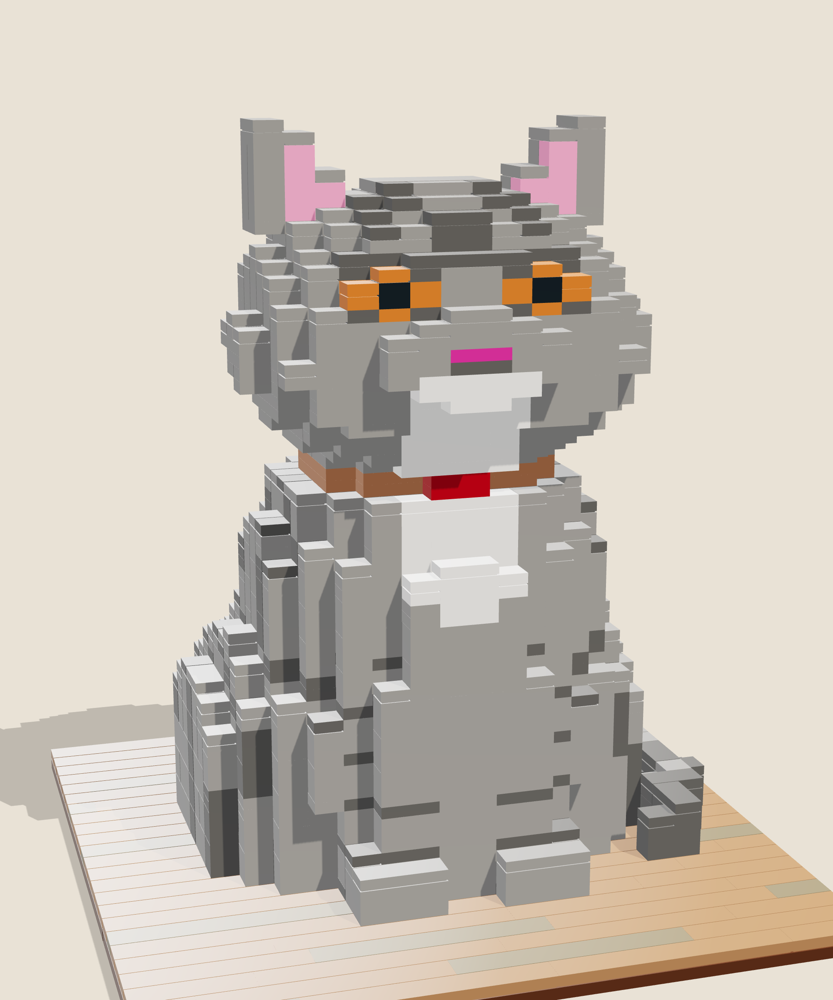

# Mèo Anh lông ngắn (British Shorthair Cat) in LEGO

A life-size LEGO sculpture of a blue-grey tabby British Shorthair, built from a photograph. It has amber eyes, a pink nose, a white muzzle and chest, and a peach collar with a red buckle. The cat sits on wooden floor boards, with its tail curled round on the floor.



| Deliverable | File |
|---|---|
| Renderings | [`renders/`](renders): front, three-quarter, side, back, face close-up, head turned |
| Interactive 3D model | [`index.html`](index.html): turn the head, use "Look around", and step through the build |
| Parts to order | [`parts/bricklink-wanted-list.xml`](parts/bricklink-wanted-list.xml), [`parts/rebrickable-parts.csv`](parts/rebrickable-parts.csv), [`parts/parts-list.csv`](parts/parts-list.csv), [`parts/parts-list.md`](parts/parts-list.md) |
| Building instructions | [`instructions/British-Shorthair-Cat-Instructions.pdf`](instructions/British-Shorthair-Cat-Instructions.pdf) |
| LDraw model | [`british-shorthair-cat.mpd`](british-shorthair-cat.mpd): opens in BrickLink Studio |

## How it is built

* **Shape.** The cat is modelled in [`model/build.mjs`](model/build.mjs) as blended ellipsoids and capsules: haunches, chest, front legs, paws, neck, a round skull, full cheeks, muzzle, ears, and a five-segment tail. The shape is sampled at one stud across and one plate high (8 × 3.2 mm), so the head is 12 studs (9.6 cm) wide, about the size of a real cat's.
* **Colour.** The fur pattern is painted into the voxels: leg bands, flank stripes, the forehead "M", the white muzzle, chin and chest bib, and the collar. The eyes, nose, mouth and inner ears are painted onto the frontmost voxel of each column.
* **Bricks.** [`../lib/voxel.mjs`](../lib/voxel.mjs) turns each layer into bricks, plates and tiles. It uses a brick where a colour continues for three layers, and a tile where the top is exposed. An overhanging cell always shares a plate with a supported neighbour, so every piece stays connected. The body is hollow, with a shell 2 studs thick.
* **Turning head.** A 4 × 4 turntable (3403c01) sits on a hidden 4 × 4 support column inside the neck. The head, from the collar up, is fixed only to the turntable. The top of the body is finished in smooth tiles, so the head turns on them.

`tools/check.mjs` reports 0 collisions and 0 unconnected parts. As with the pagoda, this is a digital design that has not yet been built from real bricks. The check covers geometry and stud connections, not clutch strength.

## Rebuilding

```sh
cd task003 && export PROJECT=cat
node cat/model/build.mjs && node tools/check.mjs && node tools/bom.mjs
node tools/pack.mjs && node tools/render.mjs && node tools/manual.mjs && node tools/bundle-viewer.mjs
```
