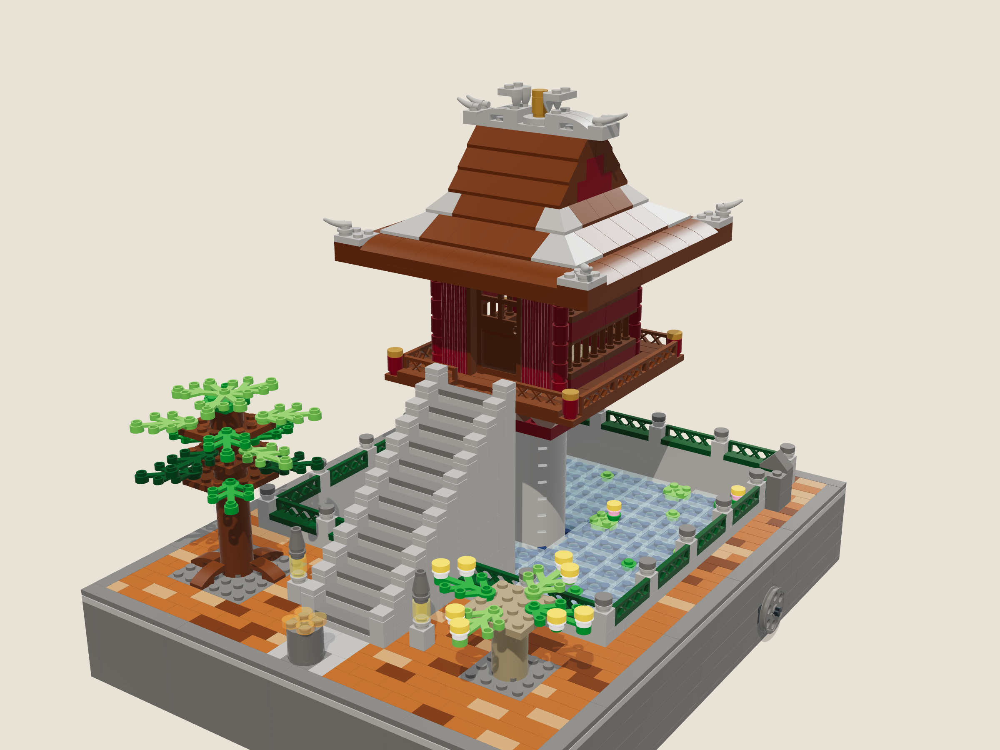

# Chùa Một Cột (One-Pillar Pagoda) in LEGO

A 1,366-piece LEGO display model of the One-Pillar Pagoda in Hà Nội. It sits on a 32 × 40 stud base (25.6 × 32 cm) and stands about 35 cm tall, at minifigure scale (about 1:37).



## What is in this folder

| Deliverable | File |
|---|---|
| Renderings | [`renders/`](renders): front hero, back, front elevation, top view, shrine close-up, ridge dragons, roof lifted off, drive mechanism |
| Interactive 3D model | [`index.html`](index.html): open it in a browser (loads three.js from jsDelivr). You can turn the crank, open the door, lift the roof, switch to night mode and step through the build. |
| Parts to order | [`parts/bricklink-wanted-list.xml`](parts/bricklink-wanted-list.xml) (upload to BrickLink), [`parts/rebrickable-parts.csv`](parts/rebrickable-parts.csv) (import to Rebrickable), [`parts/parts-list.csv`](parts/parts-list.csv) and [`parts/parts-list.md`](parts/parts-list.md) (readable list with LEGO colour names) |
| Building instructions | [`instructions/One-Pillar-Pagoda-Instructions.pdf`](instructions/One-Pillar-Pagoda-Instructions.pdf): 129 A4 landscape pages, 8 bags, 113 steps, sub-assembly callouts and a parts inventory |
| LDraw model | [`one-pillar-pagoda.mpd`](one-pillar-pagoda.mpd): opens in BrickLink Studio, LDCad and LeoCAD, with all steps and 4 sub-models |

## The building and the model

| Real building | Model |
|---|---|
| Stone pillar 1.2 m across, about 4 m above the water | 7 round 4 × 4 bricks (87081), 4 studs across |
| Shrine (Liên Hoa Đài) about 3 × 3 m, set on a frame like an opening lotus | 10 × 10 stud shrine on a 14 × 14 platform carried by 8 curved struts (inverted slopes) |
| 13 stone steps up from the bank | 13 steps, each 1 stud deep and 2 plates high |
| Roof of old red tiles with curled corners; two dragons facing the moon (*lưỡng long chầu nguyệt*) on the ridge | Hip-and-gable roof: curved eaves, 33° and 45° slopes, upturned corner tips and two dragons facing a gold pearl |
| Linh Chiểu pond with a balustrade of green glazed ceramic | Trans-light-blue water, lotus pads and flowers, green lattice balustrade on stone posts |
| Garden with the bodhi tree given by India | Bodhi tree, a frangipani in flower, stone lanterns, incense urn, stele, terracotta paving |

### Moving parts

* **Turning statue.** The crank wheel on the right side of the base (as you face the stairs) turns a worm gear under the pond. The worm drives a 24-tooth gear on a 16L axle, which runs up through the pin holes of the round pillar bricks and the Technic plates in the capital and floor. At the top the axle grips a 2 × 2 round plate that carries the gilded Quan Âm statue on her lotus throne. That plate rests on a smooth 2 × 2 round tile with a hole. 24 turns of the crank give one turn of the statue, and the worm holds the statue in place when you let go.
* **Door.** The front door (60623) is hinged in its frame and opens inward. The statue has room to turn while it is open.
* **Roof.** The roof is a separate module that sits on the studs of the wall plate. Lift it off to see inside.

Mechanism dimensions (in LDraw units, 1 stud = 20 LDU): the worm axis is 46 LDU above the base plate. The 24-tooth gear sits on a bush on a round tile, so its centre is at 45.6 LDU. The worm and the vertical axle are 2 studs apart, the standard worm-to-24-tooth spacing.

## Ordering the parts

1. **BrickLink (recommended):** go to *Wanted → Upload*, upload `parts/bricklink-wanted-list.xml`, then use *Easy Buy* to find stores.
2. **LEGO Pick a Brick:** import `parts/rebrickable-parts.csv` into a Rebrickable part list, then use its "Buy parts" tool to see which lots LEGO sells. Search Pick a Brick by design number and the LEGO colour name in `parts-list.md` (for example "3039" in "Reddish Brown").
3. **BrickLink Studio:** open `one-pillar-pagoda.mpd`, then *File → Export → BrickLink XML*, or use the price check. Studio also flags any part and colour pair that has never been made.

Some part and colour pairs could not be confirmed as produced. `parts-list.csv` marks each one with a fallback colour: the Dark Green lattice fence, the Light Bluish Gray horns, the Pearl Gold 2 × 2 round plate with one stud, the Dark Tan round brick and the Reddish Brown inverted corner slope. The large Dark Blue plates under the water and all Dark Bluish Gray and Light Bluish Gray base bricks are hidden, so any colour works for them. Order a few spare 1 × 1 round plates, tiles and flowers; small parts get lost.

## How it was made and checked

The model is generated by code in [`model/`](model), one file per bag, from real LDraw part geometry (fetched from the official LDraw parts library into `ldraw/`, which is git-ignored). [`tools/check.mjs`](tools/check.mjs) uses that geometry to test every part:

* **Collisions:** no two parts overlap (bounding boxes without studs, with round parts tested as circles). Axles are allowed through holes, and the worm is allowed to mesh with its gear.
* **Connections:** every part links back to the base plates through stud connections, axles or hinges.

The current model passes with 0 collisions and 0 unconnected parts (see `build/check.txt` after a build).

This is a digital design that has not yet been built from real bricks. The checks cover geometry and stud connections. They do not cover clutch strength, gear backlash, or how firmly an axle grips a round plate. When you build it:

* Test the drive before closing the pond floor (step 10). The worm must mesh cleanly with the 24-tooth gear. If it binds or slips, move the bush on the vertical axle up or down by a fraction.
* The platform overhangs the lotus struts by 2 studs on every side. Press the platform plates down firmly.

## Rebuilding everything

The shared tools live one level up in `task003/`; see [`../README.md`](../README.md).

```sh
cd task003 && npm install
export PROJECT=pagoda
node pagoda/model/build.mjs   # -> pagoda/build/model.json, pagoda/build/one-pillar-pagoda.mpd
node tools/check.mjs -v       # collisions and connectivity
node tools/bom.mjs            # -> pagoda/parts/
node tools/pack.mjs && node tools/render.mjs && node tools/manual.mjs && node tools/bundle-viewer.mjs
```

Credits: part geometry comes from the [LDraw](https://www.ldraw.org) parts library (CC BY 2.0) and is rendered with [three.js](https://threejs.org) (MIT). LEGO® is a trademark of the LEGO Group, which does not sponsor or endorse this model.
